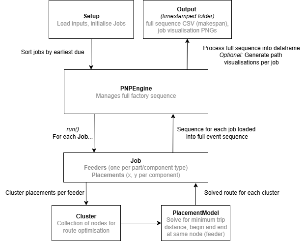

# pnp-opt

This repository models a **Pick-and-Place (PNP)** machine, a class of Surface-Mount Device (SMD) machine consisting of a robotic arm and head that sequentially mounts parts onto printed circuit boards (PCBs).

It demonstrates a simplified model that combines some heuristics and clustering with a mixed-integer LP optimisation to **reduce the total head travel distance and overall cycle time/makespan**.

---

## Problem Setup

A PNP machine must assemble multiple **jobs** (each corresponding to a PCB design) using a set of **feeders** that supply electronic components and a set of **placements** that define where those components are mounted.

### Objectives
- Minimise total head travel distance (and therefore cycle time).
- Determine an efficient **placement order** for each PCB.
- Decide the sequence of **jobs** (greedy order by due time for now).

### Inputs
Inputs are stored in `input/**/setup.xlsx`, containing:
| Sheet | Description |
|-------|--------------|
| `machine` | Machine parameters: head count, capacity, speed, pick/place/align times |
| `feeders` | Feeder IDs, part type, pickup coordinates |
| `jobs` | Job metadata (ID, name, due time, quantity) |
| `placements` | PCB component placements: coordinates and part types |

---

## Model Breakdown

The overall problem is decomposed into layers:

### 1️⃣ Job Scheduling
Simply order jobs by due time (`due_time_s`).
This could later be replaced with an optimisation layer to account for real-world considerations **revenue/margin, feeder changeovers** etc.

### 2️⃣ Within-Job Structure
Each job contains:
- Feeders (unique per part type)
- Placements (specific to the PCB)
- Machine parameters (speed, pickup/placement times)

### 3️⃣ Clustering (Pre-Solver Heuristic)
Placements for each part type are divided into clusters limited by the head’s pick capacity (e.g., 3–6 parts per trip).
Placements are assigned greedily based on distance from the feeder pickup point.

This forms a set of **independent trips** for each feeder.

### 4️⃣ Placement-Level MILP
Solving a trip is analogous to solving a **travelling-salesman-type problem** (TSP), determining the optimal sequence of placements:
- Start and end at the same feeder.
- Visit all placements once.
- Minimise total travel distance.

Pyomo + HiGHS are used as solver backend.

The solution output is optimal, though test datasets are small and this approach will not scale to real-world application (thousands of jobs per makespan, thousands of placements per job).

### 5️⃣ Event Reconstruction & Output
The solver results are converted into a detailed sequence of **Events** (`PICKUP`, `PLACE`, `TRAVEL`, `CHANGEOVER`).
These are used to:
- Build a combined job sequence (`full_sequence.csv`)
- Generate path visualisations (`*.png`) via `matplotlib`

---

## Flow Diagram



---

## Running the Model

### 1. Set up environment
```bash
conda create -n pnp python=3.11
conda activate pnp
pip install -r requirements.txt
```

### 2. Run script

```bash
python main.py
```

### 3. Outputs

```bash
output/results_2025-10-08T14_21_05/
│
├─ job_1.png              # Path visualisation
├─ job_2.png
└─ full_sequence.csv      # Complete event log (incl. makespan)
```
